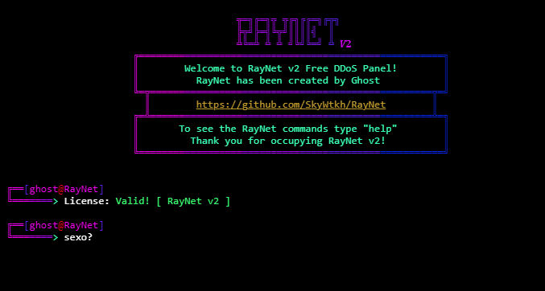

# RayNet v2 🐐
> RayNet version 2 will bring: new methods + new tools + installer!
4 Bypass 🐐<br>Layer 7 Methods ⚡<br>Layer 4 Methods ⚡<br>Tools 🛠️<br>

# Image:


# Installation:
```sh
git clone https://github.com/SkyWtkh/RayNet
sudo apt-get install python3
sudo apt-get install python3-pip
cd RayNet
sudo python3 installer.py
ulimit -n 999999
sudo python3 "ray"
```

# Credits
```sh
MHProDev
Empfaked
im-federal
R00tS3C
(Methods <3)
Z3NTL3
(UI <3)
N0rmie
(Ideas <3)
```

# TOS:
```sh
Do not attack government pages (.gov/.gob), educational pages (.edu) or the United States Department of Defense (.mil), 
the creator is not responsible for the damage caused by the attacks. 
remember: you are responsible for the attacks since this tool was created for educational purposes
```

# NOTE:
```sh
THE METHODS FOR LAYER 4 ARE NOT WORKING!
IN THE NEXT UPDATE THEY WILL BE ACTIVE
```
